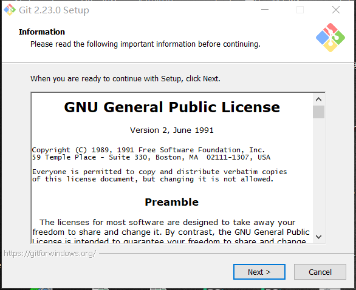
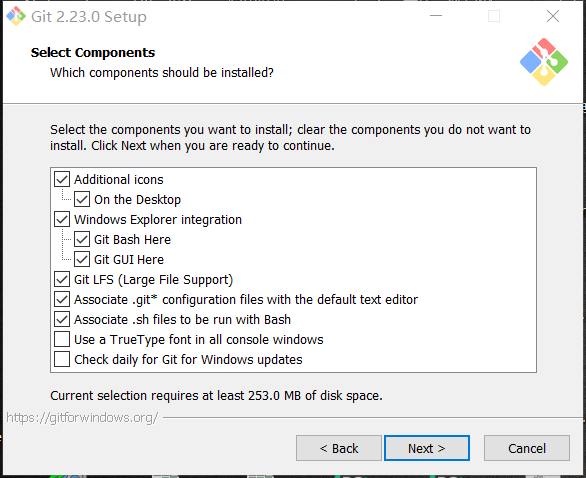
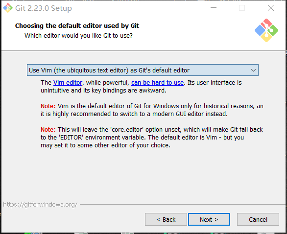
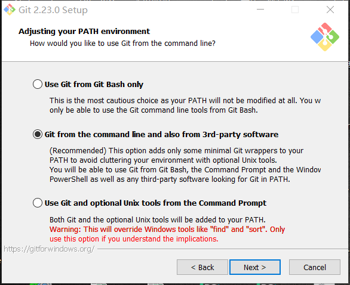
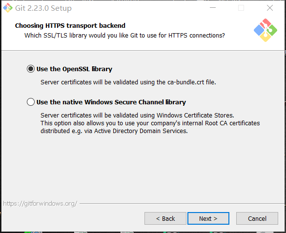
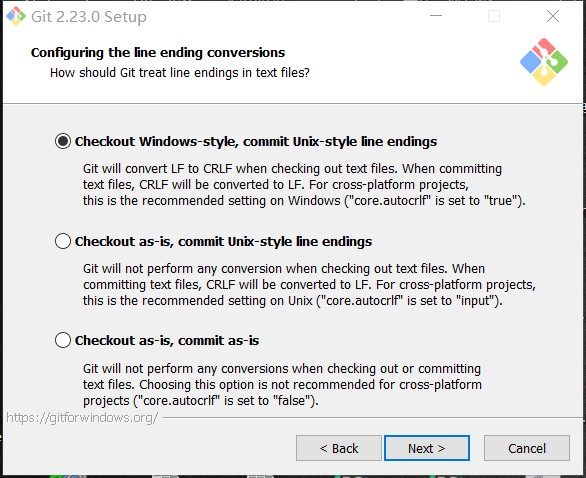
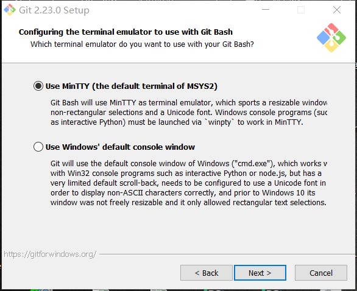
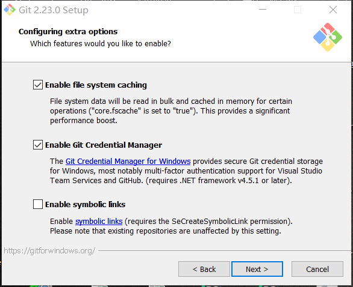

如何安装git
# Windows
## windows安装git
- 首先去 https://git-scm.com/downloads 下载操作系统对应的 Git-2.23.0-64-bit.exe

1.如下图: (点击next)

   

2.选择需要安装的配置文件,下一步
   
   

3.选择默认的编辑器,下一步

   

4.勾上第二项，这样就可以在cmd中操作，下一步

   

5.直接下一步

   

6.继续下一步

   

7.默认即可,下一步

   

8.继续下一步进行安装

   
# linux
- **系统自带**
# Mac
- **系统自带**