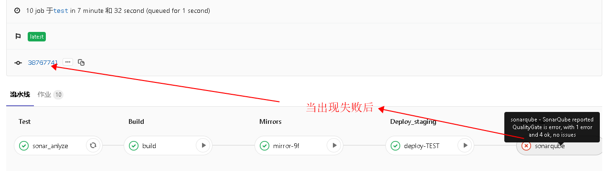
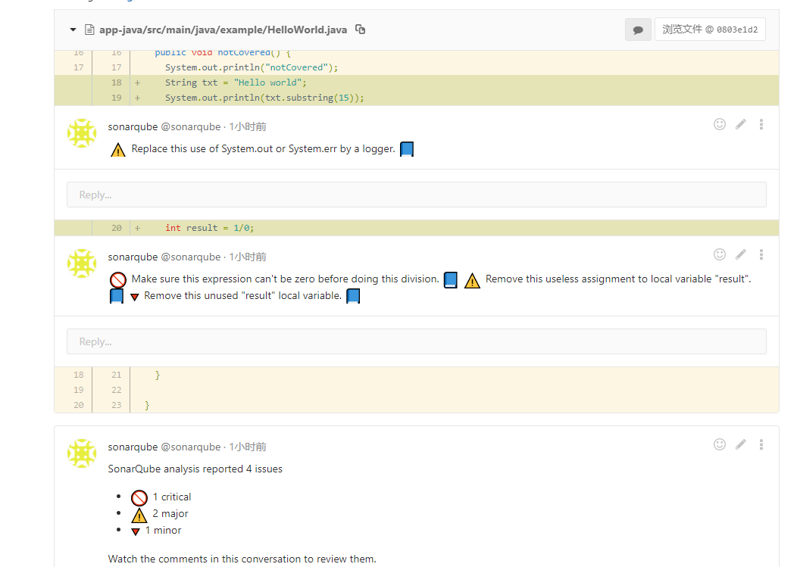
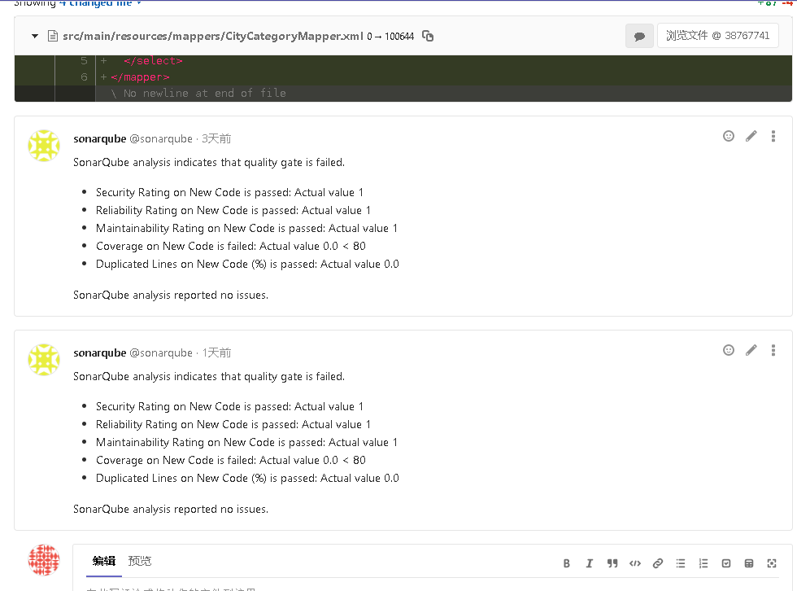

Sonarqube的测试结果会直接以**comment注释**的形式集成到Gitlab上,当然sonarqube上也有。

## Git上直接查看失败原因

- 如果是出现在本次提交文件中的bug、warnning会直接以备注的方式显示到对应的行上

- 如果没有出现在本次,会显示到最下面

## Sonarqube上查看
直接等陆,支持gitlab第三方登录

[上一模块Git与Jira集成](git-jira)

[返回目录](home)

[下一模块Git与JaCoCo集成](git-jacoco)
