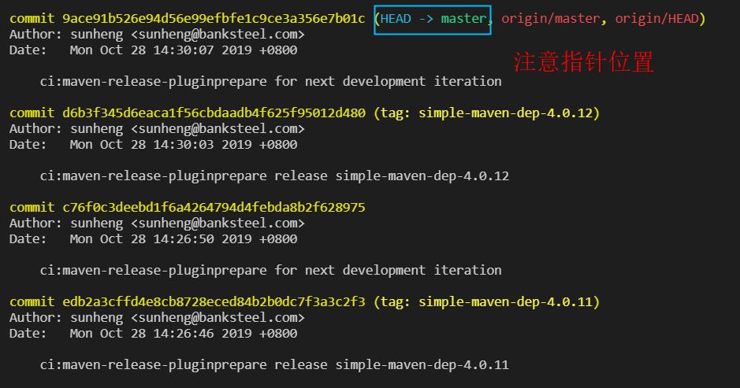

[TOC]

# Git 有哪些常规操作？

我们简单说说Git有哪些常规操作，能够让我们应付简单的开发需求。

## 常用命令

### 克隆代码

- 克隆远端代码 

`git clone <版本库的网址> <本地目录名> `

- 查看本地的代码状态

```shell
git status
// 可以明确的呈现出本地仓库的状态
// 哪些文件发生改动，哪些文件已经提交到本机
// 以及一些操作指示。
```

  

-  同步远端分支变化

```shell
// 拉取指定分支的变化
git fetch origin master 
// 拉取所有分支的变化
git fetch 
// 拉取所有分支的变化，并且将远端不存在的分支同步移除【推荐】
git fetch -p
```

- 同步远端代码变化。

```shell
// 都是先 git fetch，然后执行合并操作
// 不同的是，git pull 执行的是 git merge，git pull -r 执行的是git rebase
git pull origin master 
git pull -r origin master
```

### 操作 commit

首先我们要明确一个概念：就是每个 commit 都是一份完整的代码状态，用一个 commitID 来唯一标志。


从某个角度上来说，Git维护的就是一个commitID树，分别保存着不同状态下的代码。 所以你对代码的任何修改，最终都会反映到 commit 上面去。

#### 新增 commit

```shell
// 添加文件到缓存区，然后提交到本地仓库
git add files
git commit -m '提交备注'
```

`git add` 命令将工作目录中的变化添加到缓存区。它告诉 Git 你希望下一个提交中包含这个文件的更新。不过，`git add` 不会实际上并不会改变你的仓库。直到你运行 `git commit` ，更改都没有真正被记录。

使用这些命令的同时，你还需要 `git status` 来查看工作目录和缓存区的状态。

#### 撤销 commit

```shell
// 会将提交记录回滚，代码不回滚
git reset b14bb52
// 会将提交记录和代码全部回滚
git reset --hard b14bb52
// 将部分代码文件回滚
git checkout -- files
```

#### 合并 commit 
合并 commit，本质上合并两份不同状态下的代码。
```shell
// Git 提供了两种合并 commit 的方式
git merge master
git rebase master
```

那么 git rebase 和 git merge 到底有什么区别呢？ merge是两个分支处理冲突后，新增一个 commit 追加到master上。 rebase是将someFeature分支上的commit记录追加到主分支上，值得注意的是，这个时候commit其实已经发生变化。

  

相对来说，git merge 处理冲突更直接，而git rebase 能够保证清晰的 commit 记录。

合并 commit 的时候，通常会发生冲突。 可以全局搜索特殊字符比如<<<，找到需要处理的代码位置，然后认真分析应该保留哪一部分代码。


在团队协作的时候，分支是必不可少的。那么应该如何对分支进行操作呢？

### 操作分支

所谓的分支其实就是一个指向 commitID 的指针，你可以去`cat .git/refs/heads`里去看看。




通常情况下，**我们建议分支至少能够明确的标记功能名称，如果能标记用户就更好了**，比如sunheng/feature。

#### 查看分支


可以同时看到本地分支和远端分支，配合上前文介绍的git fetch -p可以第一时间查看到最新的分支信息。

#### 新增本地分支 其实就是创建一个指针指向某一个 commitID。

```shell
// 从当前分支新增一个新的分支sunheng/feature
// 一般情况下，我们应该从master或者其他稳定分支来新增分支
git branch sunheng/feature  //新建分支
git checkout sunheng/feature // 切换分支
// 以上两条等于下面一条
git checkout -b sunheng/feature // 新建并切换分支
```

#### 切换分支/commit

```shell
git checkout sunheng/feature // 切换分支
git checkout HEAD^ // 切换到上一次提交
git checkout HEAD~2 // 切换到第二个父提交
git checkout 1ab1afe2da9f3f66df34badec37978b07f06bf73 //切换到1ab1afe2da9f3f66df34badec37978b07f06bf73
```

#### 删除本地分支 其实就是移除一个指向 commitID 的指针。

```shell
// 删除本地分支，如果本地还有未合并的代码，则不能删除
git branch -d sunheng/feature
// 强制删除本地分支
git branch -D sunheng/feature
```

####  新增远端分支 
通常情况下，我们是新建本地分支，然后更新到远端的方式来新增一个远端分支
```shell
git push origin sunheng/feature
```

#### 删除远端分支
同样，我们也是通过更新到远端的方式来删除一个远端分支

```shell
// 等同于git push origin -d sunheng/feaure
git push origin :sunheng/feature
```

### 标记/标记(tag)

- 用于标记部署和发布。
- 带注释的标签是Git历史中不可改变的部分。
- 可以随意设置和移除软/轻量标签。
- 许多项目将带注释的发布标记与稳定的分支组合在一起。
- 考虑自动设置部署/发布标记。

**标签格式**

1. 创建一个轻量级标签。
`git tag my_lightweight_tag         // Lightweight tag for HEAD`
2. 创建带注释的标签。

`git tag -a v1.0 -m ‘Version 1.0’  //  Annotated tag for HEAD` 

`git tag -a v1.1 -m ‘Version 1.1’ C1 //  Annotated tag for HEAD` 

 我们将这个标签命名为 `v1.0`，并且明确地让它指向提交记录 `C1`，如果你不指定提交记录，Git 会用 `HEAD` 所指向的位置。 

3. 查看所有tag
`git tag -l, --list               // list tag names`
4. 删除tag
`git tag -d <tagname>`
5. 将标记推送到远程存储库。
`git push origin --tags`

> [更多资源](http：//git-scm.com/book/en/Git-Basics-Tagging)

##  简单汇总

上面说的可能有些分散，这儿简单总结一下有哪些经常使用的操作：

```shell
git status // 查看本地代码状态
git add files // 添加代码到缓存区
git commit -m '提交内容的备注' // 提交代码到本地仓库
git checkout -b branchName // 不加-b就是普通切换分支
git fetch -p // 同步远端分支状态
git pull -r origin branchName // fetch远端代码到本地，并且以rebase的方式合并代码
git push origin branchName // 更新本地代码到远端
git tag -a 1.0.0-Release -m '1.0.0版本:新增XXX，fixXXXX' // 打tag并增加说明,公共分支建议在web上完成，可以附上jira或git的issue号
git push --tags origin 1.0.0-Release             // 
git push --tags gitbook gitbook:1.0.0-Realease  // 这里我有多个远程分支,相见remote.md 如何和远程仓库交互
```


# 常用命令组合版

**创建/初始化一个项目project**

```shell 
git clone #这里要改成你自己的项目地址ssh://git@git.banksteel.com:1845/root/gitguidebook.git
cd bilibili
touch README.md
git add README.md
git commit 
git push -u origin master
```

本地存在的文件夹

```shell 
cd existing_folder
git init
git remote add origin #这里要改成你自己的项目地址ssh://git@git.banksteel.com:1845/root/gitguidebook.git
git add .
git commit -m "Initial commit"
git push -u origin master
```

本地存在的git仓库

```shell
cd existing_repo
git remote rename origin old-origin
git remote add origin #这里要改成你自己的项目地址ssh://git@git.banksteel.com:1845/root/gitguidebook.git
git push -u origin --all
git push -u origin --tags
```

### 提交commit

**命令（提交）**

```shell
vim XX.XX                   // 编辑XX文件 
git status                 // 将其列为已更改的文件（工作区域）
git diff                  // 查看差异
git add <file>           // 暂存文件
git commit              // commit提交更新 
git push origin master // 将提交推送到远程master分支
git status -sb        // 查看工作区及暂存区当前状态
git log              // 查看git日志
```

###  功能分支/创建分支branch

- 高效的并行工作平台
- 开发一个功能在一个分支
- 保持更改独立性
- 1对1的专注于问题
- 经常性的push分支

> 这是一个方便的备份你的代码的方式

```
git checkout -b squash_some_bugs  // 创建一个分支叫做 ‘squash_some_bugs’ / 'fix_some_bug'
vim bugs.py/test.go/fix.java     // Edit ‘code’ and remove all the bugs.
git status
git add bugs.rb      
git commit                     // Commit.
git checkout dev              // 切回开发分支
git merge [branch]           //  合并指定分支到当前分支，如果有冲突需要手动合并冲突（就是手动编辑文件保存咯），然后add,commit再提交
git push origin dev         //  推送到远程公共分支
```

### 合并冲突

- 经常发生。
- 学习解决冲突很难。
- 实践是完美的。
- 公共分支绝对不强制推送。小心！

**合并冲突步骤**

- 创建新分支并编辑conflicts.rb。添加'Line4'和'Line5'。
- commit and push
- 切换分支到master和编辑conflicts.rb。在'Line3'下面添加'Line6'和'Line7'。
- commit and push 到 master
- 创建合并请求

**合并冲突命令**

> 创建合并请求后，您应该注意到存在冲突。通过变基本地解决冲突。

```
git rebase master

# Fix conflicts by editing the files.

git add conflicts.rb
git commit 
git rebase --continue
git push origin <branch>
```

- [引申阅读--git rebase的妙用](https://www.codercto.com/a/45325.html)
- [git  resbase 和 git merge的区别](https://www.zhihu.com/question/36509119)

##  简单命令汇总
```shell
1. 在本地创建新分支：git branch newbranch
2. 在本地切换到新分支：git checkout newbranch
3. 将新分支推送到github：git push origin newbranch
4. 在本地删除一个分支：git branch -d newbranch
5. 在Gitlab远端删除一个分支：git push origin :newbranch
6. 合并sunheng/fix5403分支到dev分支 ： git checkout dev    # 切换回dev分支
                                git merge --no-ff sunheng/fix5403 合并sunheng/fix5403分支到dev分支（无冲突）
                                git push origin dev # 推送develop分支到远端
```

# 团队协作

### 合并请求Pull request

要尽可能的描述自己合并了什么 因为从commit信息上是没有显示的

[合并请求示例](https://gitlab.com/gitlab-org/gitlab-foss/merge_requests)

### 反馈和协作 code review

合并请求是反馈和协作的时间。
提供反馈很难。
尽可能地善良。
收到反馈很难。
尽可能接受。
反馈是关于最好的代码，而不是人。你不是你的代码。


> 查看代码审核code-review指南: https://github.com/thoughtbot/guides/tree/master/code-review.
>
>  知乎上的讨论: https://www.zhihu.com/question/41089988 


#### pull request，方便CodeReview

Git 不仅提供了代码托管以及代码开发的帮助，还提供了代码审核类似的功能。 当我们在功能分支开发完成之后，可以发起一个 pull request 请求，选择需要对比的两个分支


它会创建一个 pull request，制定相关人员来对代码进行 review。 **通常情况下，团队应该鼓励交叉 review，涉及到公共代码的时候，一定要让相关人 review**


## 开发流程

Git 有一些成熟的开发流程，比较主流的有两种：**基于功能分支的开发流程** 和 **GitFlow开发流程**。 相对来时，我更推荐前者，如果是复杂的大型项目，推荐GitFlow开发流程。 接下来，简单介绍下这两种协作模式。

**基于功能分支的协作模式**

基于功能分支的开发流程其实就是一句话：用分支来承载功能开发，开发结束之后就合并到 master 分支。 他的优点是能够保证master分支的整洁，同时还能让分支代码逻辑集中，也便于 CodeReview。

**分支命名规范**

推荐使用如下格式：ownerName/featureName。 这样既便于知道分支覆盖的功能，也便于找到分支的负责人。以后清理分支的时候也很方便。

### 分支开发流程

✦ 从 master 切出一个新分支

```text
git checkout -b sunheng/newFeature
```

✦ 开发一些新功能，然后提交 建议较多频次的提交代码到**本地仓库**，以便能够更灵活的保存或撤销修改。 此外为了保证提交日志的清晰，建议备注清楚的注释。

```text
git status
git add files // 挑选需要提交的文件，或者全部提交
git commit -m '提交备注'
git push origin sunheng/newFeature //可选 方便自己异开发机开发
```

✦ 如果功能开发完成，可以发起一个CodeReview流程 ✦ 如果代码测试通过，合并到 master，然后准备上线

```text
// 冗余版 合并到 master
git checkout master 
git pull -r origin master
git checkout sunheng/newFeature
git rebase master // 在自己分支处理冲突
git checkout master
git merge sunheng/newFeature
git push origin master
// 精简版 合并到 master
git checkout sunheng/newFeature
git pull -r origin master // 将master的代码更新下来，并且rebase处理冲突
git push origin master // 将本地代码更新到远端
```

有几点需要注意： 不要在master合并代码，保证master的可用性很重要。 确保在正确的分支执行正确的操作。 无论是处理冲突还是更新远端代码，请保有敬畏之心。

### GitFlow 开发流程

GitFlow 比前文讲的基于功能分支的开发流程要复杂得多，它更适合大型的复杂项目。 它围绕项目发布流程定义了一个严格的分支模型，所有的开发流程都是围绕这个严格的分支模型进行。 而这个模型约定了每个分支的角色，以及他们如何沟通。

我们先来看看 GitFlow 开发流程中几个约定的分支，以及他们各自承担的角色是怎么样的？


- Master分支：用于存放线上版本代码，可以方便的给代码打版本号。 
- Develop分支：用于整合 Feature 分支。 
- Feature分支：某个功能的分支，从 Develop 分支切出，并且功能完成时又合并回 Develop 分支，不直接和 Master 分支交互。 
- Release分支：通常对应一个迭代。将一个版本的功能全部合并到 Develop 分支之后，从 Develop 切出一个 Release 分支。这个分支不在追加新需求，可以完成 bug 修复、完善文档等工作。务必记住，代码发布后，需要将其合并到 Master 分支，同时也要合并到 Develop 分支。 
- Hotfix分支：紧急修复的分支，是唯一可以从 Master 切出的分支，一旦修复了可以合并到 Master 分支和 Develop 分支。

从每个分支的功能和约定可以看出，它流程多约束多，对于小规模应用并不适合。 当然 GitFlow 有一些辅助工具 gitflow 可以自动化的完成这些任务，对于大型项目也很有帮助。

> 详见[GitWorkFlow的简单介绍](../gitworkflow.md)

# Git 有哪些小技巧?

Git 操作除了基本的代码管理功能，还有一些小技巧能够让你眼前一亮。

**git reflog，查看操作记录**

这个我一定要放在第一个介绍，因为它曾经数次解救了我的代码


仔细看上图，reflog 记录了你所有的 git 命令操作，对于复原某些莫名其妙的场景或者回滚误操作有极大的帮助。

试想一个场景：你使用`git reset --hard commitID`把本地开发代码回滚到了一个之前的版本，而且还没有推到远端，怎么才能找回丢失的代码呢？ 你如果使用 git log 查看提交日志，并不能找回丢弃的那些 commitID。 而 git reflog 却详细的记录了你每个操作的 commitID，可以轻易的让你复原当时的操作并且找回丢失的代码。 当然，如果你丢失的代码都没有提交记录，那么恭喜你，你的代码真的丢了。

**压缩提交记录**

这也是一个很实用的功能，前文提过，我们在开发中的时候尽量保持一个较高频率的代码提交，这样可以避免不小心代码丢失。但是真正合并代码的时候，我们并不希望有太多冗余的提交记录，而且 rebase 合并代码的时候，会把每个 commit 都处理一下，有时候会造成冗余的工作。 所以，压缩日志之后不经能让 commit 记录非常整洁，同时也便于使用 rebase 合并代码。

那么，如何压缩commit记录呢？ 

- 使用 git log 找到起始 commitID 
- git reset commitID，切记不要用 --hard 参数 
- 重新 git add && git commit 
- `git push -f origin branchName`，因为会有冲突，所以需要强制覆盖远端分支，请务必谨慎，只建议在功能分支/自己的分支上操作。
- 合并到 master 中，然后更新远端 master。

此外还有两种压缩日志的办法： 

- git commit --amend：追加 commit 到上一个 commit 上。 
- git rebase -i：通过交互式的 rebase，提供对分支 commit 的控制，从而可以清理混乱的历史。

从实际应用来说，三种日志压缩都很优秀，git reset 更简单，git rebase -i 更细腻。

**git rebase，合并代码**

前文简单介绍了 git rebase 和 git merge 的区别，坦率讲，他们各有优劣。 git rebase 能让你的 commit 记录非常整洁，无论是线上回滚还是 CodeReview 都更轻松；但却是一个有隐患的操作，使用时务必谨慎。 git merge 操作更安全，同时也更简单；但却会增加一些冗余的 commit 记录。

这儿简单说说 rebase 的合并流程和注意事项吧。看下图


有三个点需要注意： 

- rebase 先找出共同的祖先节点 
- 从祖先节点把 pay 分支的提交记录摘下来，然后 rebase 到 master 分支 
- rebase 之后的 commitID 其实已经发生了变化 尤其是第三点，经常会让人误操作，所以务必注意。


另外要注意，**绝不要在公共的分支上使用 rebase！！！**


所以，为了安全，团队可以考虑采用 merge。

**git hook，Git 的生命周期**

这个大多数人应该都，听说过，git操作有它自身的生命周期，在不同的生命周期，我们可以做一些自动化的事情。

举两个简单的例子： ✦ pre-commit的时候我们可以做 eslint ✦ post-commit的时候，我们可以做利用 jenkins 类似的工具做持续集成

当然还有更多的声明周期，具体可以参考 Git 钩子

**git submodule && git subtree，管理第三方模块**

这两个命令通常用来管理公用的第三方模块。比如一些通用的底层逻辑、中间件、还有一些可能会频繁变化的通用业务组件。 当然，两者还是有区别的。 git submodule 主要用来管理一些单向更新的公共模块或底层逻辑。 git subtree 对于部分需要双向更新的可复用逻辑来说，特别适合管理。比如一些需要复用的业务组件代码。在我之前的实践中，我也曾用subtree来管理构建系统逻辑。

**git alias，简化 Git 命令**

我们可以通过配置 git alias 来简化需要输入的 Git 命令。 比如前文的 git subtree 需要输入很长的 Git 命令，我们可以配置 .git/config 文件来解决。

```text
// git stpull appfe demo/xxx
// git stpush appfe demo/xxx
[alias]
 stpull = !git subtree pull --prefix=$1 appfe $2 
 && :
 stpush = !git subtree pull --prefix=$1 appfe $2 
 && git subtree split --rejoin --prefix=$1 $2 
 && git subtree push --prefix=$1 appfe $2 
 && :
```
