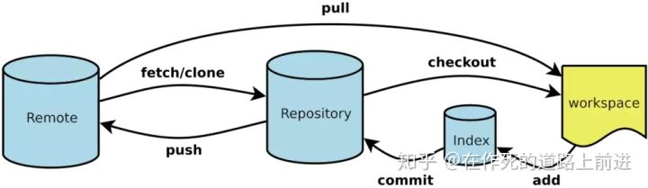

[基础设置](#基础设置)

[常用命令](#常用命令)

[git安装及图形化软件推荐](#GUI版软件推荐)

[Help](#Help!)

[ERROR](#error)

[参考](#Reference)


下面仅列举一些快速食用的命令和终端推荐

# 基础设置

## 安装完成git后打开git bash 

**Git 全局配置(安装好git就需配置)**

```
curl https://git.banksteel.com/sunheng/git-learn/raw/master/template/git-commit-template-common.txt > ~/.git-commit-template-common.txt
git config --global user.name "你的名字"
git config --global user.email "你的邮箱"
git config --global commit.template ~/.git-commit-template-common.txt 
git config --global pull.rebase true
```

> 以上配置清逐条复制添加到本地。以上配置可以在 ~/.gitconfig 文件中手动修改，可以在[git config](#git的配置)详细了解

> 用户提交代码之后，GitLab 会将 git config 中的邮箱与用户 email 进行匹配。如果匹配成功，则可以上传。
值得注意的是：当邮箱匹配时，commit 的用户名是用户的 GitLab 的用户名，而不是 git config 中的。如果邮箱不匹配，则使用 git config 中的用户名和邮箱。

**配置 SSH Key**

`ssh-keygen -t rsa -b 4096 -C "you@computer-name"`
> -C 选项可省
```
# You will be prompted for the following information. Press enter to accept the defaults. Defaults appear in parentheses.
Generating public/private rsa key pair.
Enter file in which to save the key (/Users/you/.ssh/id_rsa):
Enter passphrase (empty for no passphrase):
Enter same passphrase again:
Your identification has been saved in /Users/you/.ssh/id_rsa.
Your public key has been saved in /Users/you/.ssh/id_rsa.pub.
The key fingerprint is:
39:fc:ce:94:f4:09:13:95:64:9a:65:c1:de:05:4d:01 you@computer-name
```
复制你的公钥并添加到你的**gitlab 个人资料**中
    1. `cat ~/.ssh/id_rsa.pub`
    2. `ssh-rsa AAAAB3NzaC1yc2EAAAADAQEL17Ufacg8cDhlQMS5NhV8z3GHZdhCrZbl4gz you@example.com`

# 常用命令

**创建一个项目**

```shell 
git clone #这里要改成你自己的项目地址http://192.168.100.3/root/bilibili.git
cd bilibili
touch README.md
git add README.md
git commit 
git push -u origin master
```
本地存在的文件夹

```shell 
cd existing_folder
git init
git remote add origin #这里要改成你自己的项目地址http://192.168.100.3/root/bilibili.git 
git add .
git commit -m "Initial commit"
git push -u origin master
```

本地存在的git仓库
```shell
cd existing_repo
git remote rename origin old-origin
git remote add origin #这里要改成你自己的项目地址http://192.168.100.3/root/bilibili.git
git push -u origin --all
git push -u origin --tags
```

**Git 概念**



#### 工作原理

- Workspace:工作区，执行``git add`命令就把改动提交到了暂存区，执行git pull命令将远程仓库的数据拉到当前分支并合并，执行`git checkout [branch-name]`切换分支
- Index:暂存区，执行`git commit`命令就把改动提交到了仓库区（当前分支）
- Repository:仓库区（或本地仓库），执行`git push origin master`提交到远程仓库，执行`git clone` 地址将克隆远程仓库到本地
- Remote:远程仓库，就是类似github，coding等网站所提供的仓库

#### 文件分类

- 未跟踪的文件
以前没有告诉过Git的新文件。
- 工作区域
已修改但未提交的文件。
- 临时区域
已标记为已在下次提交中进行的已修改文件。

#### git的配置

```shell
显示当前的Git配置
$ git config --list
编辑Git配置文件，只是配置用户信息的话直接看下面两行命令即可
$ git config -e [--global]
设置提交代码时的用户信息，是否加上全局--global自行决定，一般是直接设置全局的。
$ git config [--global] user.name "[name]"
$ git config [--global] user.email "[email address]"
设置的是默认使用的文本编辑器
$ git config --global core.editor emacs
```


### **提交**

1. 编辑' edit_this_file.rb'in' training-examples'。
2. 将其列为已更改的文件（工作区域）。
3. 查看差异。
4. 暂存文件。
5. commit提交更新
6. 将提交推送到远程。
7. 查看工作区及暂存区当前状态
8. 查看git日志。

**命令（提交）**

```
# Edit `edit_this_file.rb`
git status
git diff
git add <file>
git commit 
git push origin master
git status -sb
git log
```

### **功能分支/创建分支**

- 高效的并行工作平台
- 开发一个功能在一个分支
- 保持更改独立性
- 1对1的专注于问题
- 经常性的push分支

> 这是一个方便的备份你的代码的方式

**分支步骤**

1. 创建一个分支叫做 ‘squash_some_bugs’ / 'fix_some_bug'.
2. Edit ‘code’ and remove all the bugs.
3. Commit.
4. 合并指定分支到当前分支，如果有冲突需要手动合并冲突（就是手动编辑文件保存咯），然后add,commit再提交
5. Push.

```
git checkout -b squash_some_bugs
# Edit `bugs.rb`
git status
git add bugs.rb
git commit 
git checkout dev   # 切回开发分支
git merge [branch]
git push origin dev
```

**合并请求**

要尽可能的描述自己合并了什么 因为从commit信息上是没有显示的

[[合并请求示例](https://gitlab.com/gitlab-org/gitlab-ce/merge_requests)

**反馈和协作**

合并请求是反馈和协作的时间。
提供反馈很难。
尽可能地善良。
收到反馈很难。
尽可能接受。
反馈是关于最好的代码，而不是人。你不是你的代码。

查看代码审核codeview指南: https://github.com/thoughtbot/guides/tree/master/code-review.

**合并冲突**

- 经常发生。
- 学习解决冲突很难。
- 实践是完美的。
- 修复冲突后强制推送。小心！

**合并冲突步骤**

- 创建新分支并编辑conflicts.rb。添加'Line4'和'Line5'。
- commit and push
- 切换分支到master和编辑conflicts.rb。在'Line3'下面添加'Line6'和'Line7'。
- commit and push 到 master
- 创建合并请求

**合并冲突命令**

> 创建合并请求后，您应该注意到存在冲突。通过变基本地解决冲突。

```
git rebase master

# Fix conflicts by editing the files.

git add conflicts.rb
git commit 
git rebase --continue
git push origin <branch> -f
```

- [引申阅读--git rebase的妙用](https://www.codercto.com/a/45325.html)
- [git  resbase 和 git merge的区别](https://www.zhihu.com/question/36509119)

**标签**

- 用于标记部署和发布。
- 带注释的标签是Git历史中不可改变的部分。
- 可以随意设置和移除软/轻量标签。
- 许多项目将带注释的发布标记与稳定的分支组合在一起。
- 考虑自动设置部署/发布标记。

**标签步骤**

1. 创建一个轻量级标签。
2. 创建带注释的标签。
3. 将标记推送到远程存储库。

> [更多资源](http：//git-scm.com/book/en/Git-Basics-Tagging)

**命令（标签）**

```
git checkout master

# Lightweight tag
git tag my_lightweight_tag

# Annotated tag
git tag -a v1.0 -m ‘Version 1.0’
git tag

git push origin --tags
```

**其他命令**

用来查看历史
`git log`
用来查看所有历史
`git  reflog `
通过commit中的提交号来回滚版本，其中xxxxxx为版本号,主要是前六位，也可以是前四位，保证与其他版本号不一致即可。
` git reset --hard xxxxxx`
`git reset --soft XXXXXX`

##### 建议的合作方式

1. fork\派生 这个仓库
2. clone\克隆 你复制的仓库到本地
3. 创建属于你的要完成的任务的分支并转换到这个分支
4. 提交这个分支到你的仓库
5 做pull request\合并请求

> Note **fork** first

```shell
 git clone git@gitlab.com:你的用户名/项目名.git
 cd 项目文件夹
 git branch your_sample_name
 git checkout your_sample_name
 vim samples/your_sample_name.py
 git add samples/your_sample_name.py
 git commit
 git push origin your_sample_name
```

现在你可以到official project \主仓库 创建合并请求了
如何在Github上创建、删除分支、合并到master

```shell
1. 在本地创建新分支：git branch newbranch
2. 在本地切换到新分支：git checkout newbranch
3. 将新分支推送到github：git push origin newbranch
4. 在本地删除一个分支：git branch -d newbranch
5. 在Github远端删除一个分支：git push origin :newbranch
6. 合并fix5403分支到develop分支 ： git checkout develop    # 切换回develop分支
                                git merge --no-ff fix5403 合并fix5403分支到develop分支（无冲突）
                                git push origin develop # 推送develop分支到远端
```
> **更详细的信息请阅读Reference,建议从后往前看，git精通比较困难，在使用中学习更好**

----


# GUI版软件推荐

1. git-gui : 官方自带，用来提交 相当于add commit  

    gitk    : 官方自带,用来查看历史记录 相当于log
[git官方下载地址](https://git-scm.com/downloads "下载路径")

    > 给 Windows 用户的敬告：你应该在 msysGit 提供的 Unix 风格的 shell 来运行 Git。在 Unix 风格的 shell 中，可以使用本书中提及的复杂多行的命令。
🤞 即一直点下一步就好


2. GitHub 发布了两个面向工作流程的 Git 客户端：Windows 版，和 Mac 版。

3. SourceTree : 类似github官方版 不过现在必须注册 atlassian或Bitbucket的账户 就是开发jira的公司

4. TortoiseGit ： window版**目前推荐**
[tortoisegit下载地址](https://tortoisegit.org/download/ "tortoisegit下载地址")

# Help!

当你卡壳的时候请用下面的方式

- Use ‘git help <command>’ command.
- Use Google.
- Read documentation at https://git-scm.com

> **更详细的信息请阅读Reference**


# error
以下收集的是遇见的常见问题

1. Windows下git GUI或者git Bash 出现`fatal: protocol 'ssh' is not supported`

解: 一般为字符问题 可以尝试在链接前后加`''`即**双引号**解决, 比如'ssh://git@git.banksteel.com:1845/sunheng/pineline-test.git'

# Reference

[git中文](https://git-scm.com/book/zh/v2/%E8%B5%B7%E6%AD%A5-%E5%85%B3%E4%BA%8E%E7%89%88%E6%9C%AC%E6%8E%A7%E5%88%B6)

[自定义git配置](https://git-scm.com/book/zh/v1/%E8%87%AA%E5%AE%9A%E4%B9%89-Git-%E9%85%8D%E7%BD%AE-Git)

[知乎:利用github和git进行多人协作开发](https://zhuanlan.zhihu.com/p/23478654)

[git rebase的好处](https://www.codercto.com/a/45325.html)

[commit message 和changes log编写指南](http://www.ruanyifeng.com/blog/2016/01/commit_message_change_log.html)

[前端工程化的代码规范](https://zhuanlan.zhihu.com/p/71143472?utm_source=wechat_session&utm_medium=social&utm_oi=910223710001184768)

[git入门](https://zhuanlan.zhihu.com/p/78206003?utm_source=ZHShareTargetIDMore&utm_medium=social&utm_oi=910223710001184768)