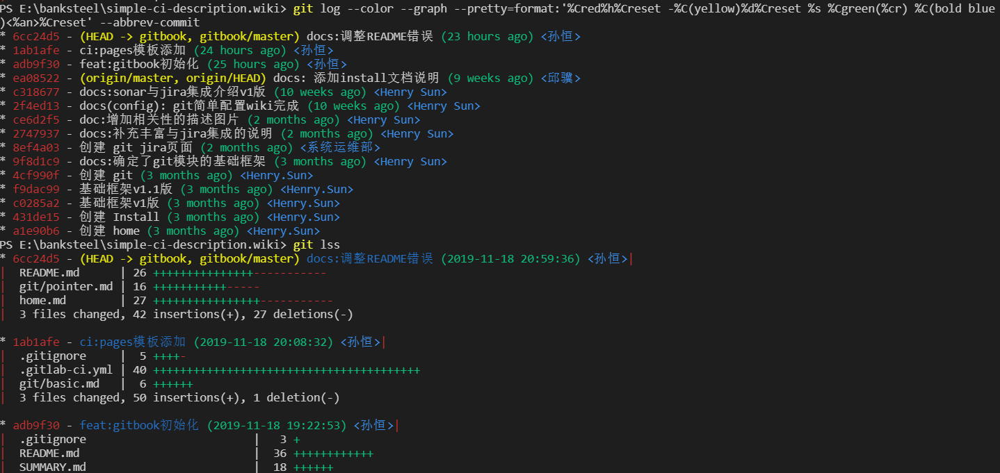

- [基础设置](#基础设置)
  - [常用查询命令](#常用查询命令)
  - [为git log详细输出配置alias别名](#为gitlog详细输出配置alias别名)


下面仅列举一些快速食用的命令和终端推荐

# 基础设置

## 安装完成git后打开git bash 

**Git 全局配置(安装好git就需配置)**

```
curl https://git.banksteel.com/sunheng/git-learn/raw/master/template/git-commit-template-common.txt > ~/.git-commit-template-common.txt
git config --global user.name "你的名字"
git config --global user.email "你的邮箱"
git config --global commit.template ~/.git-commit-template-common.txt 
git config --global pull.rebase true
```

> 以上配置清逐条复制添加到本地。以上配置可以在 ~/.gitconfig 文件中手动修改，可以在[git config](#git的配置)详细了解

> 用户提交代码之后，GitLab 会将 git config 中的邮箱与用户 email 进行匹配。如果匹配成功，则可以上传。
值得注意的是：当邮箱匹配时，commit 的用户名是用户的 GitLab 的用户名，而不是 git config 中的。如果邮箱不匹配，则使用 git config 中的用户名和邮箱。

**配置 SSH Key**

`ssh-keygen -t rsa -b 4096 -C "you@computer-name"`

> -C 选项可省
```
# You will be prompted for the following information. Press enter to accept the defaults. Defaults appear in parentheses.
Generating public/private rsa key pair.
Enter file in which to save the key (/Users/you/.ssh/id_rsa):
Enter passphrase (empty for no passphrase):
Enter same passphrase again:
Your identification has been saved in /Users/you/.ssh/id_rsa.
Your public key has been saved in /Users/you/.ssh/id_rsa.pub.
The key fingerprint is:
39:fc:ce:94:f4:09:13:95:64:9a:65:c1:de:05:4d:01 you@computer-name
```
复制你的公钥并添加到你的**gitlab 个人资料**中
```shell
$ cat ~/.ssh/id_rsa.pub
ssh-rsa AAAAB3NzaC1yc2EAAAADAQEL17Ufacg8cDhlQMS5NhV8z3GHZdhCrZbl4gz you@example.com
```
#### git的配置

```shell
# 显示当前的Git配置
$ git config --list
# 编辑Git配置文件，只是配置用户信息的话直接看下面两行命令即可
$ git config -e [--global]
# 设置提交代码时的用户信息，是否加上全局--global自行决定，一般是直接设置全局的。
$ git config [--global] user.name "[name]"
$ git config [--global] user.email "[email address]"
# 设置的是默认使用的文本编辑器
$ git config --global core.editor <emacs/vim/vscode/note++你喜欢的编辑器软件>
# 设置拉取模式
$ git config --global pull.rebase true
# 设置commit模板
$ git config --global commit.template [模板文件]
```


#### 常用查询命令
- 查看工作区和暂存区状态
`git status`  

- 用来查看历史
`git log`


- 标记出文件变化显示历史
`git log --stat`


- 以图形化的形式查看历史
`git log --graph`


- 图形化且附带详细提交历史
`git log --color --graph --pretty=format:'%Cred%h%Creset -%C(yellow)%d%Creset %s %Cgreen(%cr) %C(bold blue)<%an>%Creset' --abbrev-commit`


- 用来查看所有历史
`git  reflog `

> 通过commit中的提交号来回滚版本，其中xxxxxx为版本号,主要是前六位，也可以是前四位，保证与其他版本号不一致即可。

#### 为gitlog详细输出配置alias别名

```shell
git config --global alias.lm  "log --no-merges --color --date=format:'%Y-%m-%d %H:%M:%S' --author='你的名字！自己修改！' --pretty=format:'%Cred%h%Creset -%C(yellow)%d%Cblue %s %Cgreen(%cd) %C(bold blue)<%an>%Creset' --abbrev-commit"


git config --global alias.lms  "log --no-merges --color --stat --date=format:'%Y-%m-%d %H:%M:%S' --author='你的名字！自己修改！' --pretty=format:'%Cred%h%Creset -%C(yellow)%d%Cblue %s %Cgreen(%cd) %C(bold blue)<%an>%Creset' --abbrev-commit"


git config --global alias.ls "log --no-merges --color --graph --date=format:'%Y-%m-%d %H:%M:%S' --pretty=format:'%Cred%h%Creset -%C(yellow)%d%Cblue %s %Cgreen(%cd) %C(bold blue)<%an>%Creset' --abbrev-commit"


git config --global alias.lss "log --no-merges --color --stat --graph --date=format:'%Y-%m-%d %H:%M:%S' --pretty=format:'%Cred%h%Creset -%C(yellow)%d%Cblue %s %Cgreen(%cd) %C(bold blue)<%an>%Creset' --abbrev-commit"
```

