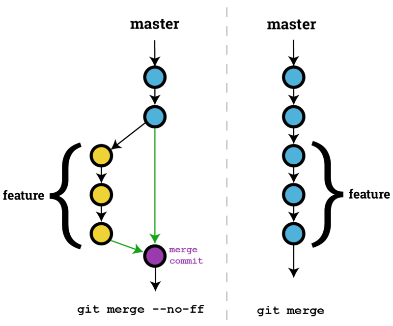

# [如何理解Git的Fast Forward 和 no fast foward合并模式？](https://segmentfault.com/q/1010000014589409)

`--no-ff `只能看到开发分支有过合并到master的记录，但是看不到开发分支在合并到master之前具体有哪些commit

如果执行了 Fast Forward，开发者根本不会看到这个分支，就像在 master 直接 commit 一样。

