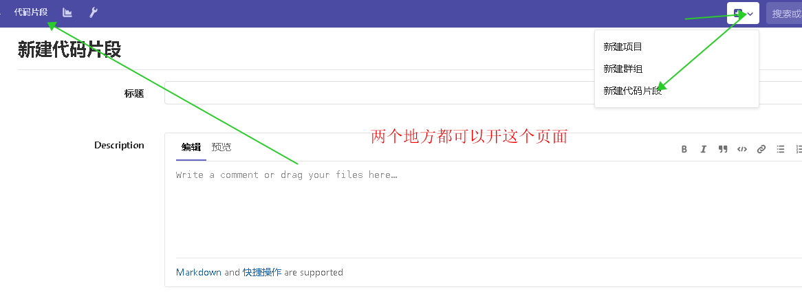

# 写在前面

Gist 是 概念类似于git的一种代码片段、文本、图片等的分布式存储方式
，具有git的基本功能版本控制、diff、log、markdown等。  探索中～～～～～～


#### 推荐食用方法

将有意思的代码放到 gist 上
踩到的坑     放到 gist 上
喜欢的网页、文献随手保存到gist上

# 直接在gitlab上编辑


# Gist 桌面版推荐

#### **Gist desktop client —— Lepton**

得益于Electron框架，Lepton可以在Windows、macOS和Linux下使用。Lepton支持多语言syntax highlight，markdown 渲染 和 Jupyter Notebook 渲染。

[github链接](https://github.com/hackjutsu/Lepton)


详情见github页

-------
# vscode 插件

打开 Extensions(Ctrl+Shift+X)
            |
         |
            v
Search搜索Gist

#### 使用方法

- 第一次启动
Press F1 and type `select profile` to initialize the profile selector. You can add as many profiles as you would like.
按F1 或者 Ctrl+ p 输入 > , 输入GIST  选择 select profile 安装个人认证.

-----------
- 命令说明

Create Gists 创建Gists

You must have a file open and active to create a gist.
你必须  打开一个文件 
Press F1 and enter the following:


`GIST: Create New Gist 创建新的Gist`

You will be prompted a gist description.
提示你输入一个 gist描述信息

Open/Edit Gists  打开/编辑Gist

Press F1 and enter one fo the following: 按F1然后选择下面一种方式
```
GIST: Open Gist

GIST: Open Favorite Gist
```
All files associated with the gist will be opened in group layout.
所以的在这个Gist的文件都会被打开

GIST: Add File

提交文件

到这里对gist单一文件的修改完成

You can also use the following commands: 你也会用到下面的命令

```
GIST: Delete Gist

GIST: Delete File

GIST: Add File

GIST: Open Gist In Browser

GIST: Insert Text From Gist File
```

# 写在后面

还有不少不错的插件

Gistot  于2017年不在维护 作者创业开发了类似的工具 cacher

更进一步的了解[知乎：如何看待Gist](https://www.zhihu.com/question/21343711)

> 6. 制作任务列表您可以用Gist跟踪待处理任务（举个栗子）。这是用纯文本的特殊语法写的但是你可以任意勾选。- [x] Pick the flowers- [ ] Call John 9303032332- [x] Cancel cable subscription- [ ] Book the flight tickets  您可以勾选或者勾去任意选项，源文本将会自动变更。如果您的Gist是公有的的话，任何人都可以看到您的列表，但是只有您（拥有者）可以改变其勾选状态。 备注：其实任务列表也可以在issue中建立，所有拥有写权限的人都可以uncheck/check。
> 7. 把Gist作为一个网页收藏夹在Chrome浏览器您可以找到一个叫GistBox的插件，通过这个插件您可以在浏览网页时选择保存网页内容为Gist。您甚至可以添加标注或者话题标签以易于以后更容易找到它们。
> 8. 把Gist嵌入网页中您用一行js代码就可以把任何一条Gist嵌入到网页中。嵌入的Gist格式不发生任何变化，而且访问者可以非常方便的把它们fork到他们的Github中。要嵌入wordpress的话有这个插件和这个短代码可以使用。