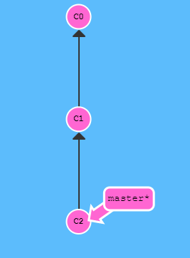

# 两种方法

- [git reset](#reset)

- [git revert](#revert)

# Reset

 `git reset` 通过把分支记录回退几个提交记录来实现撤销改动。你可以将这想象成“改写历史”。`git reset` 向上移动分支，原来指向的提交记录就跟从来没有提交过一样。 

`git reset HEAD~1`

Git 把 master 分支移回到 `C1`；现在我们的本地代码库根本就不知道有 `C2` 这个提交了。

（注：在reset后， `C2` 所做的变更还在，但是处于未加入暂存区状态。）

# Revert

虽然在本地分支中使用 `git reset` 很方便，但是这种“改写历史”的方法对大家一起使用的远程分支是无效的哦！

为了撤销更改并**分享**给别人，需要使用 `git revert`。

在我们要撤销的提交记录后面居然多了一个新提交！这是因为新提交记录 `C2'` 引入了**更改** —— 这些更改刚好是用来撤销 `C2` 这个提交的。也就是说 `C2'` 的状态与 `C1` 是相同的。

revert 之后就可以把你的更改推送到远程仓库与别人分享啦。

