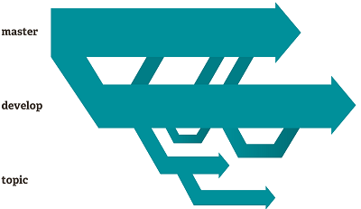
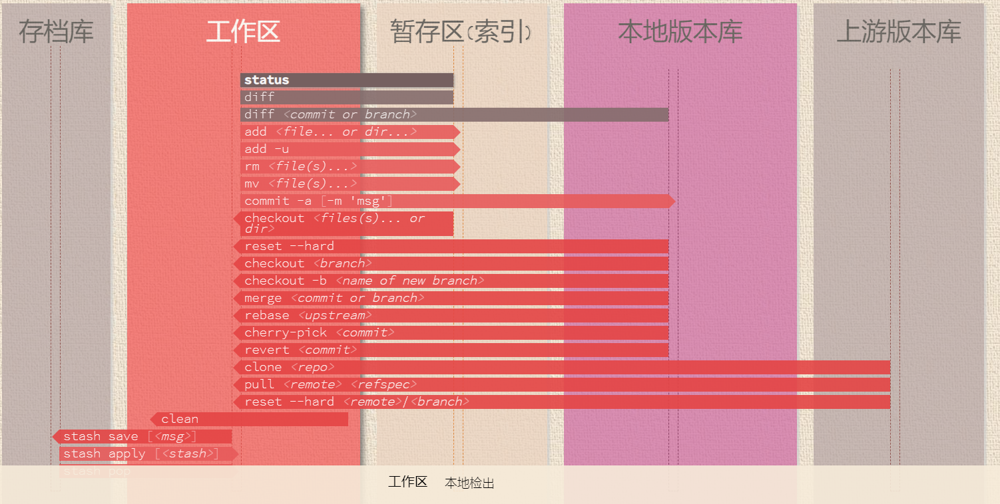
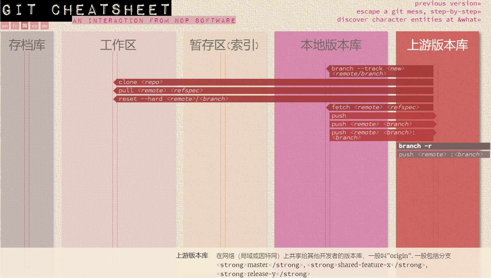
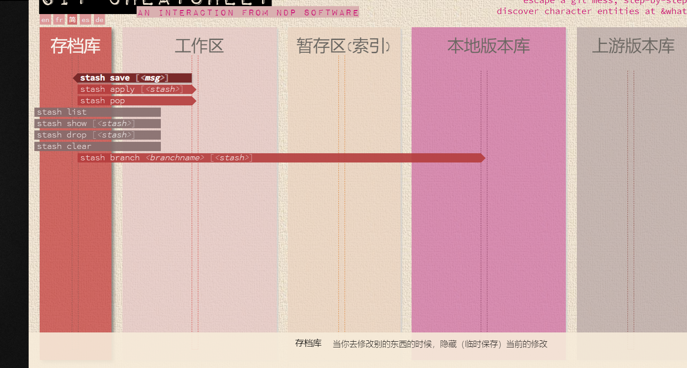

- [写在前面](#写在前面)
- [Git基本概念](#Git概念)
    - [工作原理/工作区域](#工作原理/工作区域)
    - [文件分类](#文件分类)
    - [工作区](#工作区)
    - [远程仓库](#远程仓库)
    - [暂存区](#暂存区)
    - [其他区域](#其他区域)
    
- [仓库间协作](#仓库间协作)
- [参考](#reference)

# 写在前面

Git是一个免费的开源 **分布式版本控制系统**，旨在快速高效地处理从小型到大型项目的所有事务。

- 无障碍环境切换
- 基于角色的代码线
- 基于特征的工作流程
- 一次性实验

git在此不多做介绍,我也是Noob.
强烈欢迎[访问](http://git.banksteel.com)体验

# Git概念

#### 工作原理/工作区域

- Workspace:工作区，执行`git add`命令就把改动提交到了暂存区，执行`git pull`命令将远程仓库的数据拉到当前分支并合并，执行`git checkout [branch-name]`切换分支

- Index:暂存区，执行`git commit`命令就把改动提交到了仓库区（当前分支）

- Repository:仓库区（或本地仓库），执行`git push origin master`提交到远程仓库，执行`git clone 远程仓库地址` 将克隆远程仓库到本地

- Remote:远程仓库，就是类似github，gitlab等网站所提供的仓库

- stash: 存档库，当你去修改别的东西的时候,临时保存当前的修改。(上图无体现,请往下看)

  > 一般见于切换分支时, git 提示未commit的文件是否需要stash。

#### 文件分类

- 未跟踪的文件
以前没有告诉过Git的新文件。
- 工作区域
已修改但未提交的文件。
- 临时区域
已标记为已在下次提交中进行的已修改文件。

----

## 工作区

你修改文件的地方

## 远程仓库

与小伙伴共享代码的地方,可以有多个。(即多个上游版本库)

## 存档库

## 其他区域

详见参考中的 [可视化介绍git](https://ndpsoftware.com/git-cheatsheet.html)

## 仓库间协作

这一点很重要，你要理解 Git 中「工作副本」的概念和 SVN 仓库 check out 下来的「工作副本」是很不一样的。和 SVN 不同的是，**Git 不会区分工作副本和中央仓库——它们都是功能完备的 Git 仓库**。

这就使得 Git 的协作和 SVN 截然不同。SVN 依赖于中央仓库和工作副本之间的关系，而 Git 协作模型是基于仓库和仓库之间的交互的。相对于 SVN 的提交流程，你可以在 Git 仓库之间 `push` 或 `pull` 提交。

# Reference

[git中文](https://git-scm.com/book/zh/v2/%E8%B5%B7%E6%AD%A5-%E5%85%B3%E4%BA%8E%E7%89%88%E6%9C%AC%E6%8E%A7%E5%88%B6)

[自定义git配置](https://git-scm.com/book/zh/v1/%E8%87%AA%E5%AE%9A%E4%B9%89-Git-%E9%85%8D%E7%BD%AE-Git)

[知乎:利用github和git进行多人协作开发](https://zhuanlan.zhihu.com/p/23478654)

[git rebase的好处](https://www.codercto.com/a/45325.html)

[commit message 和changes log编写指南](http://www.ruanyifeng.com/blog/2016/01/commit_message_change_log.html)

[前端工程化的代码规范](https://zhuanlan.zhihu.com/p/71143472?utm_source=wechat_session&utm_medium=social&utm_oi=910223710001184768)

[git入门](https://zhuanlan.zhihu.com/p/78206003?utm_source=ZHShareTargetIDMore&utm_medium=social&utm_oi=910223710001184768)

[可视化介绍git](https://ndpsoftware.com/git-cheatsheet.html)