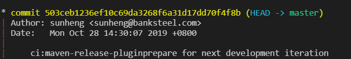
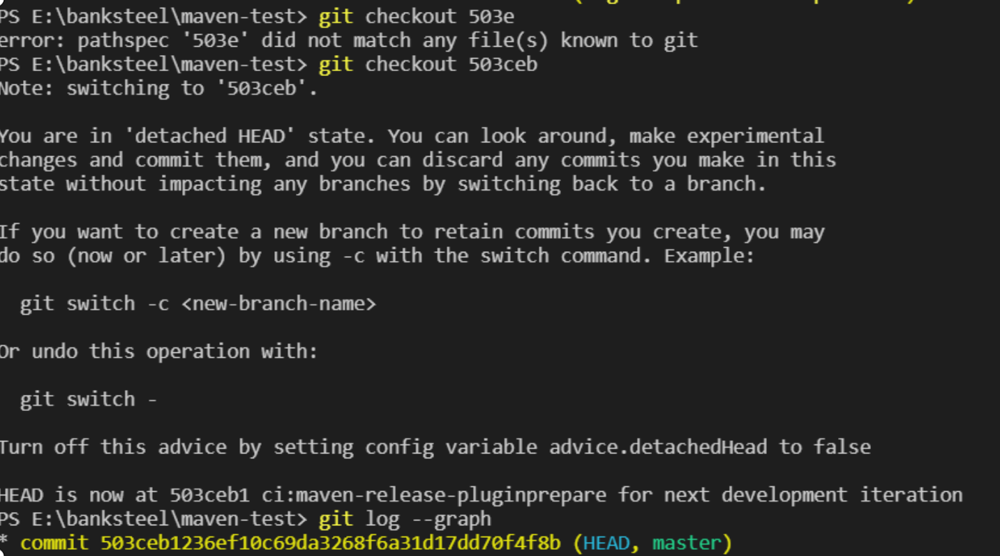

## 在提交树上移动

- [当前指针/当前引用(HEAD)](#HEAD)

- [相对引用](#相对引用)~(更快的在树间跳跃)
	* [操作符 (^)](#操作符)
	* [操作符 (~)](#操作符)
	
- [强制修改分支位置](#强制修改分支位置)

# HEAD

- HEAD 是一个对当前检出记录的符号引用 —— 也就是指向你正在其基础上进行工作的提交记录。
- HEAD 总是指向当前分支上最近一次提交记录。大多数修改提交树的 Git 命令都是从改变 HEAD 的指向开始的。
- HEAD 指向，可以通过 `cat .git/HEAD` 查看， 如果 HEAD 指向的是一个引用，还可以用 `git symbolic-ref HEAD` 查看它的指向。 

-----

### 分离的 HEAD 就是让其指向了某个具体的提交记录而不是分支名。

在命令执行之前的状态如下所示：

HEAD -> master -> 503ceb1236ef10c69da3268f6a31d17dd70f4f8b

HEAD 指向 master， master 指向 503ceb1236ef10c69da3268f6a31d17dd70f4f8b

`git checkout 503ceb1236ef10c69da3268f6a31d17dd70f4f8b(commit的hash值)`



现在变成了

HEAD -> 503ceb1236ef10c69da3268f6a31d17dd70f4f8b

# 相对引用

相对引用非常给力，这里我介绍两个简单的用法：

- 使用 `^` 向上移动 1 个提交记录
- 使用 `~` 向上移动多个提交记录，如 `~3`

###  操作符

####  (^)

 这个符号加在引用名称的后面，表示让 Git 寻找指定提交记录的父提交。 

`git checkout master^` 切换到 master 的父节点 

`git checkout master^`^ 切换到 master 的第二个父节点 

#### (~)

 如果你想在提交树中向上移动很多步的话，敲那么多 `^` 貌似也挺烦人的，Git 当然也考虑到了这一点，于是又引入了操作符 `~` 

 该操作符后面可以跟一个数字（可选，不跟数字时与 `^` 相同，向上移动一次），指定向上移动多少次 

## 强制修改分支位置

我使用相对引用最多的就是移动分支。可以直接使用 `-f` 选项让分支指向另一个提交。例如:

```
git branch -f master HEAD~3
```

上面的命令会将 master 分支强制指向 HEAD 的第 3 级父提交。

> 相对引用为我们提供了一种简洁的引用提交记录的方式， 而 `-f` 则容许我们将分支强制移动到那个位置。 

