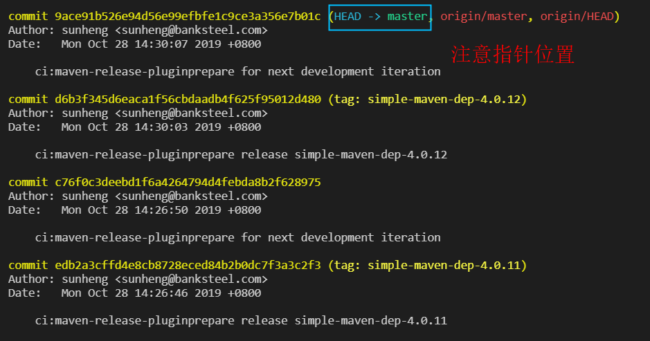

# rebase(变基)--使git记录简洁

 Rebase 实际上就是取出一系列的提交记录，“复制”它们，然后在另外一个地方逐个的放下去 

 Rebase 的优势就是可以创造更线性的提交历史，这听上去有些难以理解。如果只允许使用 Rebase 的话，代码库的提交历史将会变得异常清晰。 

当前在bugFix分支，运行`git rebase master`就会将当前分支复制到master分支

# 三种使用场景

- [修改整理commit历史](修改整理commit历史)  
- [变基/汇合提交](第二种)

## 修改整理commit历史

目的: （改写|压缩|fixup|删除)commit

解决方案:

**注意**： 不应该修改已经push到远程仓库的记录。因为你改了，别人没有改，反而更乱

```shell
git rebase -i 版本号
# 使用 git rebase -i HEAD~n 命令在默认文本编辑器中显示最近 n 个提交的列表。
git rebase -i HEAD~3 # 显示当前分支上最后 3 次提交的列表(~3从当前HEAD往前找3条)
```



```shell
// 以下效果相同
git rebase -i HEAD~3
git rebase -i edb2a3cffd4e8cb8728eced84b2b0dc7f3a3c2f3 //完整hash
git rebase -i edb2a3                                   //简短hash
```

```shell
pick c76f0c3 ci:maven-release-pluginprepare for next development iteration
pick d6b3f34 ci:maven-release-pluginprepare release simple-maven-dep-4.0.12
pick 9ace91b ci:maven-release-pluginprepare for next development iteration

# Rebase edb2a3c..9ace91b onto edb2a3c (3 commands)
#
# Commands:
# p, pick <commit> = use commit  // 使用这个commit 
# r, reword <commit> = use commit, but edit the commit message // 修改这个commit
# e, edit <commit> = use commit, but stop for amending // 额,语言能力描述不清。反正就是 用git commit --amend 修改历史提交 默认--amend是修改上一次提交历史
# s, squash <commit> = use commit, but meld into previous commit//使用commit，但是要与之前的commit合并
# f, fixup <commit> = like "squash", but discard this commit's log message // 类似于“suqash”，但是要丢弃这个提交的日志消息
# x, exec <command> = run command (the rest of the line) using shell
# b, break = stop here (continue rebase later with 'git rebase --continue')
# d, drop <commit> = remove commit
# l, label <label> = label current HEAD with a name
# t, reset <label> = reset HEAD to a label
# m, merge [-C <commit> | -c <commit>] <label> [# <oneline>]
# .       create a merge commit using the original merge commit's
# .       message (or the oneline, if no original merge commit was
# .       specified). Use -c <commit> to reword the commit message.
#
# These lines can be re-ordered; they are executed from top to bottom.
#
# If you remove a line here THAT COMMIT WILL BE LOST.
#
# However, if you remove everything, the rebase will be aborted.
#
# Note that empty commits are commented out
```

```shell
$ git rebase -i HEAD~3
Stopped at d6b3f34...  ci:maven-release-pluginprepare release simple-maven-dep-4.0.12
You can amend the commit now, with

  git commit --amend

Once you are satisfied with your changes, run

  git rebase --continue
```


