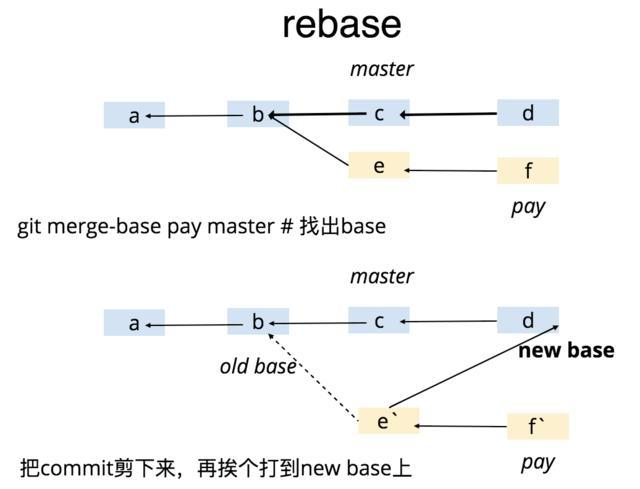

# rebase(变基)--使git记录简洁

 Rebase 实际上就是取出一系列的提交记录，**“复制”**它们，然后在另外一个地方逐个的放下去 



有三个点需要注意： 

- rebase 先找出共同的祖先节点 
- 从祖先节点把 pay 分支的提交记录摘下来，然后 rebase 到 master 分支 
- rebase 之后的 commitID 其实已经发生了变化 尤其是第三点，经常会让人误操作，所以务必注意。

Rebase 的优势就是可以创造更线性的提交历史，这听上去有些难以理解。如果只允许使用 Rebase 的话，代码库的提交历史将会变得异常清晰。 

**当前在pay分支，运行`git rebase master`就会将当前分支复制到master分支**

## rebase的黄金法则

一旦你理解了什么是rebase，最重要的是了解什么时候不使用它。git rebase的黄金法则是永远不要在公共分支使用它。(如果你理解了rebase，可以放宽到未push到remote仓库的commit)
例如，想想如果你把master分支rebase到你的feature分支会发生什么：


rebase将master所有提交移动到feature顶端。问题是这只发生在你的仓库中。所有其他开发人员仍在使用原始版本master。由于rebase导致全新的提交，Git会认为你的master分支的历史与其他人的历史不同。
同步两个master分支的唯一方法是将它们合并在一起，从而产生额外的合并提交和两组包含相同更改的提交（原始提交和来自rebase分支的更改）。这将是一个非常令人困惑的情况。
因此，在你运行git rebase之前，总是问自己，“还有其他人在用这个分支吗？”如果答案是肯定的，那就把你的手从键盘上移开，考虑使用非破坏性的方式进行（例如，git revert命令）。否则，你可以随心所欲地重写历史记录。

**如果你不理解以上的黄金法则，**

 在不用`-f`的前提下，想维持树的整洁，方法就是：在`git push`之前，先`git fetch`，再`git rebase`。 

```shell
git fetch origin master
git rebase origin/master
git push
# 或者
git push -r origin master 
```


# 三种使用场景

- [修改整理commit历史](修改整理commit历史)  
- [变基/汇合提交](#变基)

## 修改整理commit历史

目的: （改写|压缩|fixup|删除)commit

解决方案:

**注意**： 不应该修改已经push到远程仓库的记录。因为你改了，别人没有改，反而更乱

```shell
git rebase -i 版本号
# 或使用 git rebase -i HEAD~n 命令在默认文本编辑器中显示最近 n 个提交的列表。
git rebase -i HEAD~3 # 显示当前分支上最后 3 次提交的列表(~3从当前HEAD往前找3条)
```


```shell
// 以下效果相同
git rebase -i HEAD~3
git rebase -i edb2a3cffd4e8cb8728eced84b2b0dc7f3a3c2f3 //完整hash
git rebase -i edb2a3                                   //简短hash
```

```shell
pick c76f0c3 ci:maven-release-pluginprepare for next development iteration
pick d6b3f34 ci:maven-release-pluginprepare release simple-maven-dep-4.0.12
pick 9ace91b ci:maven-release-pluginprepare for next development iteration

# Rebase edb2a3c..9ace91b onto edb2a3c (3 commands)
#
# Commands:
# p, pick <commit> = use commit  // 使用这个commit 
# r, reword <commit> = use commit, but edit the commit message // 修改这个commit
# e, edit <commit> = use commit, but stop for amending // 额,语言能力描述不清。反正就是 用git commit --amend 修改历史提交 默认--amend是修改上一次提交历史
# s, squash <commit> = use commit, but meld into previous commit//使用commit，但是要与之前的commit合并
# f, fixup <commit> = like "squash", but discard this commit's log message // 类似于“suqash”，但是要丢弃这个提交的日志消息
# x, exec <command> = run command (the rest of the line) using shell
# b, break = stop here (continue rebase later with 'git rebase --continue')
# d, drop <commit> = remove commit
# l, label <label> = label current HEAD with a name
# t, reset <label> = reset HEAD to a label
# m, merge [-C <commit> | -c <commit>] <label> [# <oneline>]
# .       create a merge commit using the original merge commit's
# .       message (or the oneline, if no original merge commit was
# .       specified). Use -c <commit> to reword the commit message.
#
# These lines can be re-ordered; they are executed from top to bottom.
#
# If you remove a line here THAT COMMIT WILL BE LOST.
#
# However, if you remove everything, the rebase will be aborted.
#
# Note that empty commits are commented out
```

```shell
$ git rebase -i HEAD~3
Stopped at d6b3f34...  ci:maven-release-pluginprepare release simple-maven-dep-4.0.12
You can amend the commit now, with

  git commit --amend

Once you are satisfied with your changes, run

  git rebase --continue
```


# 变基

 作为merge的替代方法，你可以使用以下命令将feature分支rebase到master分支上：
`git checkout feature`
`git rebase master`
这会将整个feature分支移动到master分支的顶端，从而有效地整合了所有master的新提交。但是，rebase不是使用merge commit，而是通过为原始分支中的每个提交创建全新的提交来重写项目历史记录。 


##  强制推


如果你尝试将rebase过的master分支推到远程仓库，Git将阻止你这样做，因为它与远程master分支冲突。但是，你可以通过传递--force标志来强制推送，如下所示：
`＃这个命令要非常小心！`
`git push --force`
这将覆盖远程master分支以匹配rebase过的分支，并使团队的其他成员感到困惑。因此，只有在确切知道自己在做什么时才能非常小心地使用此命令。
工作流
rebase可以根据你团队的需要尽多地或少量地整合到你现有的[Git工作流程](https://link.zhihu.com/?target=https%3A//bitbucket.org/product%3Futm_source%3Ddzone%26utm_medium%3Dpaid-content%26utm_content%3Dmerging-vs-rebasing%26utm_campaign%3Dbitbucket_adexp-bbtofu_dzone-syn-content)中。在本节中，我们将了解rebase在功能开发的各个阶段的好处。
任何工作流程git rebase的第一步是为每个功能创建专用分支。这为你提供了必要的分支结构，以安全地利用rebase：


##   本地清理


将rebase加入[工作流程](https://link.zhihu.com/?target=https%3A//bitbucket.org/product%3Futm_source%3Ddzone%26utm_medium%3Dpaid-content%26utm_content%3Dmerging-vs-rebasing%26utm_campaign%3Dbitbucket_adexp-bbtofu_dzone-syn-content)的最佳方法之一是清理本地正在进行的功能。通过定期执行交互式rebase，你可以确保功能中的每个提交都具有针对性和意义。这使你可以写代码而无需担心将其分解为隔离多个的提交 - 你可以在事后修复它。
调用git rebase时，有两个基（base）选项：feature的父分支（例如master），或feature中的历史提交。我们在Interactive Rebasing部分看到了第一个选项的示例。当你只需要修复最后几次提交时，后一种选择很好。例如，以下命令仅针对最后3次提交的交互式rebase。
`git checkout feature`
`git rebase -i HEAD~3`
通过指定HEAD~3为新的基，你实际上并没有移动分支 - 你只是交互式地重写其后的3个提交。请注意，这不会将上游更改合并到feature分支中。


如果要使用此方法重写整个功能，git merge-base命令可用于查找feature分支的原始基。以下内容返回原始基础的提交ID，然后你可以将其传递给git rebase：
`git merge-base feature master`
交互式rebase的使用是引入git rebase工作流的好方法，因为它只影响本地分支。其他开发人员唯一能看到的就是你的成品，这应该是一个简洁易懂的分支历史记录。
但同样，这仅适用于私有功能分支。如果你通过相同的分支与其他开发人员协作，则该分支是公共的，并且你能重写其历史记录。

##  将上游更改合并到feature中


在概念部分中，我们了解了feature分支如何使用git merge或git rebase合并master上游更改。merge是一个安全的选择，可以保留仓库的整个历史记录，而rebase则通过将feature分支移动到master顶端来创建线性历史记录。
这种使用git rebase类似于本地清理（并且可以同时执行），但在此过程中它包含了那些master上游提交。
请记住，rebase到远程分支而不是master。当与另一个开发人员协作使用相同的功能并且你需要将他们的更改合并到你的仓库时，就会发生这种情况。
例如，如果你和另一个名为John的开发人员新增了对feature分支的提交，从John的仓库中获取远程分支后，你的仓库可能如下所示：


你可以用从master集成上游更改相同的方法来解决这个分叉问题：要么用john/feature合并本地feature，或rebase本地feature到john/feature。


请注意，此rebase不违反黄金法则，因为只有你的本地feature提交被移动 - 之前的所有内容都不会受到影响。这就像是“将我的更改添加到John已经完成的工作。”在大多数情况下，这比通过merge与远程分支同步更直观。
默认情况下，git pull命令执行合并，但你可以通过向其传递--rebase选项来强制它与远程分支rebase集成。

##  集成已验证的feature


在你的团队通过某feature后，你可以选择将该feature rebase到master分支的顶端，然后git merge再将该功能集成到主代码库中。
这是将上游更改合并到功能分支中的类似情况，但由于你不允许在master分支中重写提交，因此你必须最终使用git merge该功能进行集成。但是，通过在合并之前执行rebase，你可以确保合并产生完美的线性历史记录。这也使你有机会压缩在拉取请求期间添加的任何后续提交。


如果你不熟悉git rebase，可以随时在临时分支中执行rebase。这样，如果你不小心弄乱了feature的历史记录，可以查看原始分支，然后重试。例如：
`git checkout feature`
`git checkout -b temporary-branch`
`git rebase -i master`
`＃[清理历史]`
`git checkout master`
`git merge temporary-branch`

##  总结


这就是你需要知道的关于rebase你的分支。如果你更喜欢提交的干净，消除不必要合并的线性历史记录，那么你在继承另一分支的更改时应该使用git rebase 而不是git merge。
另一方面，如果你想保留项目的完整历史记录并避免重写公共提交的风险，你可以仍然使用git merge。这两种选择都是完全可以的，但至少可以选择利用git rebase有它的好处。


**git rebase，合并代码**

前文简单介绍了 git rebase 和 git merge 的区别，坦率讲，他们各有优劣。 git rebase 能让你的 commit 记录非常整洁，无论是线上回滚还是 CodeReview 都更轻松；但却是一个有隐患的操作，使用时务必谨慎。 git merge 操作更安全，同时也更简单；但却会增加一些冗余的 commit 记录。

这儿简单说说 rebase 的合并流程和注意事项吧。看下图


- 
