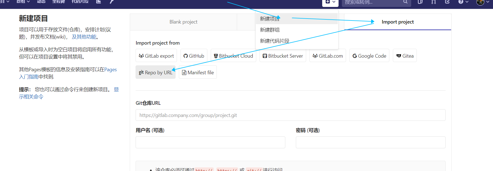
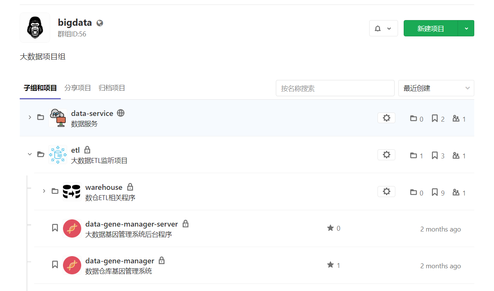

# 如何和远程仓库交互

`git clone `

`git remote`

`git pull`

`git fetch`

`git push <远程主机名> <本地分支名>:<远程分支名> `

# 添加多个远程仓库/更换远程仓库地址

## gitlab专属迁移方式

## 命令行或者IDEA中更改远程仓库地址

### 修改命令

`git remote set-url origin <新的仓库url>`

### 先删后加

`git remote rm origin` // 可以将rm 换位mv 
`git remote add origin <新的仓库url>`

### 修改config文件

如果你的项目有加入版本控制，那可以到项目根目录下，查看隐藏文件夹， 发现`.git`文件夹，找到其中的`config`文件，就可以修改其中的git remote origin地址了。

# 远程仓库建议的建立规则

1. 以**部门**为单位
   
   - 部门下面可以建立`子群组`
   
2. 以**单独的工程**为单位
   - 几个相关的工程为一个`子群组`
   

**下面是钢银这边的一个例子:**

​	   同时采取了以上的两种方法

