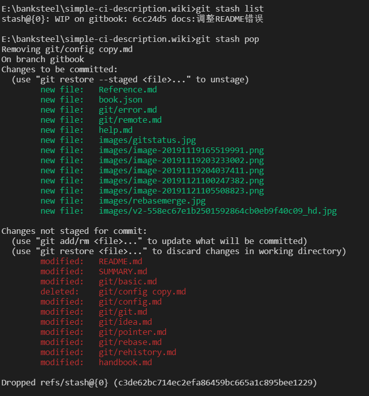

# 使用git stash命令保存和恢复进度

我们有时会遇到这样的情况，正在dev分支开发新功能，做到一半时有人过来反馈一个bug，让马上解决，但是新功能做到了一半你又不想提交，这时就可以使用`git stash`命令先把当前进度保存起来，然后切换到另一个分支去修改bug，修改完提交后，再切回dev分支，使用`git stash pop`来恢复之前的进度继续开发新功能。下面来看一下`git stash`命令的常见用法

## git stash

保存当前工作进度，会把暂存区和工作区的改动保存起来。执行完这个命令后，在运行`git status`命令，就会发现当前是一个干净的工作区，没有任何改动。使用`git stash save 'message...'`可以添加一些注释

## git stash list

显示保存进度的列表。也就意味着，`git stash`命令可以多次执行。

## git stash show [<options>] [<stash>]

类似`git log --state`,展示此次stash变更细节

## git stash pop [–index] [stash_id]

- `git stash pop` 恢复最新的进度到工作区。git默认会把工作区和暂存区的改动都恢复到工作区。
- `git stash pop --index` 恢复最新的进度到工作区和暂存区。（尝试将原来暂存区的改动还恢复到暂存区）
- `git stash pop stash@{1}`恢复指定的进度到工作区。stash_id是通过`git stash list`命令得到的
  通过`git stash pop`命令恢复进度后，会删除当前进度。

## git stash apply [–index] [stash_id]

除了不删除恢复的进度之外，其余和`git stash pop` 命令一样。

## git stash drop [stash_id]

删除一个存储的进度。如果不指定stash_id，则默认删除最新的存储进度。

## git stash clear

删除所有存储的进度。

## git stash branch <branchname> [<stash_id>]

将特定stash转化为分支

